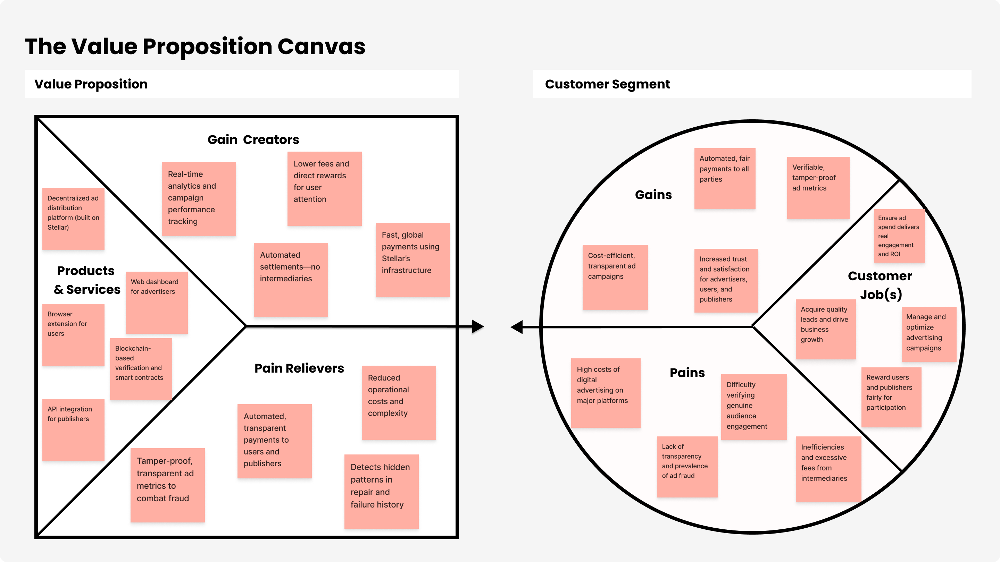

# 🌟 Hackathon Project Documentation  
**Project Name**: [Insert Your Project Name]  
**Built on**: Stellar Network  
**Team Name**: [Your Team Name]  
**Hackathon**: [Name of Hackathon]  
**Date**: [Submission Date]

---

## 🔗 Table of Contents

1. [Executive Summary & Introduction](#1-executive-summary--introduction)
2. [Problem Statement: The Pain Points](#2-problem-statement-the-pain-points)
3. [Target Audience & User Personas](#3-target-audience--user-personas)
4. [Market Analysis](#4-market-analysis)
   - [4.1 TAM, SAM, SOM Analysis](#41-tam-sam-som-analysis)
5. [SWOT Analysis](#5-swot-analysis)
6. [Solution Overview](#6-solution-overview)
    - [6.1 MVP](#71-minimal-viable-product)
    - [6.2 Differences and Advantages](#72-differences-and-advantages)
7. [How It Works: Technical Architecture & MVP](#7-how-it-works-technical-architecture) 
8. [Why Stellar?](#8-why-stellar)
9. [Business Model & Monetization](#9-business-model--monetization)
10. [Roadmap & Future Vision](#10-roadmap--future-vision)
11. [Team & Roles](#11-team--roles)
12. [References](#12-references)

---

## 1. Executive Summary & Introduction

<i>We are Adescentralized, an advertising distribution platform that uses blockchain to ensure transparent and fair payments for all parties involved. Our mission is to connect businesses with a genuine audience, ensuring that every view is verified and properly rewarded.<i>

Adescentralized is a decentralized advertising platform that revolutionizes the way ads are distributed and rewarded. Our goal is to create a transparent and fair advertising ecosystem that benefits everyone involved: businesses, hosting websites, and most importantly, users.

Our solution consists of three interconnected components, all powered by blockchain technology.

Businesses use our website to easily and intuitively manage their advertising campaigns. A comprehensive dashboard allows them to set budgets and monitor performance in real time, with access to detailed metrics such as views, engagement, and lead generation. Every ad view and user interaction is securely recorded on the blockchain, complete with a verification hash and an encrypted user ID, ensuring complete data integrity.

For end users, our browser extension serves as the gateway. Once activated, users can choose to view ads and, in return, are financially rewarded for each impression. We use XLM (Stellar Lumens) from the Stellar network to enable fast, secure transactions with minimal fees—delivering on our promise of real, tangible rewards for users' attention.

Additionally, partner websites integrate our solution to display ads and automatically receive a share of the advertiser's investment through smart contracts. This ensures a fully automated payment process without intermediaries.

Stellar forms the foundation of our platform. Its global payment infrastructure—capable of processing transactions in seconds at fractions of a cent—is the only network robust enough to support our large-scale, per-impression reward model.

At every stage, we act as guardians of transparency. We manage the invested capital, validate ad views through our API, and ensure fair distribution of funds between users and publisher sites.

Adescentralized proves that advertising can be decentralized, beneficial, and transparent—for everyone.

---

## 2. Problem Statement: The Pain Points

### Key Problems:

**Field Research: Validation of Adescentralized's Core Problems**

* a. Advertising as the Primary Method for Lead Generation in Businesses

Lead generation is widely recognized as one of the most critical objectives in marketing, with paid advertising playing a central role in acquiring quality leads. According to industry statistics, **91% of marketers consider lead generation their top priority**, highlighting its importance in driving business growth[^5]. This aligns with the fact that lead generation acts as the foundation of the sales funnel, connecting businesses with potential customers and enabling revenue growth[^4]. Paid advertising is particularly effective in outbound lead generation strategies, allowing companies to proactively reach target audiences[^1]. Furthermore, platforms like social media enable businesses to use targeted advertising to reach specific demographics, resulting in higher-quality leads[^3]. Given this context, efficient and trustworthy advertising systems are essential for sustainable business development.

* b. High Costs of Digital Advertising on Current Platforms

Despite its effectiveness, digital advertising has become increasingly expensive, especially on dominant platforms like Google and Facebook. For example, the average cost-per-click (CPC) on Google Search Ads ranges from **$2.32 to $2.69**, while costs on the Google Display Network average around **$0.63–$0.67**[^11][^13]. In some industries, such as legal or real estate, CPCs can exceed **$4**[^20]. On Facebook, average CPC varies between **$0.58 and $1.35**, depending on the source, with CPM (cost per thousand impressions) ranging from **$8.60 to $14.40**[^11][^17][^19]. These high costs place significant pressure on marketing budgets, especially for small and medium-sized enterprises. As competition intensifies, advertisers face rising prices for visibility, making it harder to achieve a positive return on investment. The financial burden of these platforms underscores the need for more cost-efficient alternatives.

* c. Lack of Transparency and Fraud in the Digital Advertising Industry

A major systemic issue in digital advertising is the lack of transparency regarding ad performance, audience verification, and budget allocation. Industry surveys indicate that trust remains a critical problem due to practices like hidden rebates and digital fraud[^21]. Ad fraud alone is a multi-billion dollar problem, involving deceptive practices that misrepresent metrics such as views and clicks, ultimately draining advertising budgets without delivering real engagement[^24]. In the first half of 2019, app install fraud cost the industry **$2.3 billion**, illustrating the scale of the issue[^22]. Fraudulent activities not only inflate costs but also distort performance data, leading to poor decision-making and inefficient use of marketing resources[^25]. This lack of accountability undermines confidence in current advertising models and highlights the need for verifiable, tamper-proof systems.

* d. Inefficiencies Caused by Intermediaries in the Ad Tech Ecosystem

The digital advertising supply chain involves numerous intermediaries—such as ad networks, demand-side platforms, and data providers—that collectively take a significant portion of the advertising budget. Studies show that middlemen fees can range from **22% to 45%** of each ad impression, with an average of **35% being absorbed by ad-tech players** before reaching publishers[^38]. This inefficiency means that a large share of advertiser spending does not go toward actual content delivery or audience engagement. Despite efforts toward supply-path optimization, an estimated **$26.8 billion is still lost annually** due to structural inefficiencies in programmatic advertising[^34]. The complexity and opacity of these transactions make it difficult for advertisers to assess the true value they receive, reinforcing the need for a decentralized, automated system that minimizes intermediaries and maximizes transparency.

---

These findings confirm that the problems Adescentralized seeks to address—high costs, lack of transparency, ad fraud, and excessive intermediary fees—are well-documented and deeply rooted in the current digital advertising landscape. By leveraging blockchain technology, smart contracts, and a user-reward model, Adescentralized offers a timely and validated solution to these pressing industry challenges.

---

## 3. Target Audience & User Personas

### Persona 1

Name: Ricardo (45 years old)
Position: Owner of a small e-commerce business selling handmade products

Ricardo is an experienced entrepreneur who has built his brand through hard work. He knows online advertising is vital for growth, but feels costs are getting out of control. He spends most of his budget on leading market ad platforms, but the reports seem like a "black box." Ricardo can't clearly understand how his money is spent and whether ad views actually convert into customers. He needs a more efficient and transparent way to invest to achieve real returns.

Goals:

Increase sales sustainably
Reduce customer acquisition cost
Have complete transparency about campaign performance and where every penny is spent
Frustrations:

Cost per impression is increasingly high
Lack of clarity in performance reports
Feeling of not having full control over his investment
Why Adescentralized is the Ideal Solution?
Adescentralized's advertising platform with its clear dashboard offers Ricardo the transparency he seeks. He can see exactly which sites his ads go to, and blockchain-based payment-per-view ensures he only pays for verified interactions. Adescentralized's fairer cost model allows Ricardo to achieve greater reach for his money.

### Persona 2

Name: Mariana (30 years old)
Occupation: Content creator and owner of a gardening blog

Mariana has dedicated years to building an engaged community on her blog. She monetizes her content through traditional ad networks but is frustrated with the lack of return. She feels exploited, as most of the revenue generated by her site traffic goes to the ad network, not to her. Payments are low and inconsistent. Additionally, she has no control over the types of ads displayed on her page, which sometimes pollutes the reading experience and causes her to lose credibility with her audience.

Goals:

Earn fair money from her high-quality content
Receive fast and transparent payments
Maintain audience trust by displaying relevant ads
Frustrations:

Low payments and delays in revenue release
Lack of control over displayed ads
Feeling that ad networks "steal" her revenue
Why Adescentralized is the Ideal Solution?
Adescentralized directly addresses the lack of transparency and low payments. The smart contract model guarantees that Mariana receives her share of the investment automatically and in real time. She will have full visibility into how much she's earning, and the transaction is verifiable on the blockchain, building a relationship of trust.

### Persona 3

Name: João (25 years old)
Occupation: University student and technology/privacy enthusiast

João deeply cares about his digital privacy. He uses ad blockers and regularly clears his browser cookies because he hates feeling tracked and bombarded by invasive and irrelevant ads. He knows advertising is how the internet works, but refuses to be a "product." He has heard of other view-reward solutions, but the volatility of currencies and the need to change browsers discourages him. He's looking for a way to have more control over his online experience and be valued for his attention.

Goals:

Protect his privacy
Browse the internet without interruptions
If possible, be fairly rewarded for viewing ads without having to completely change his browsing habits
Frustrations:

Invasive ads
Feeling that his data is being used without his consent
Complexity and volatile earnings from other reward solutions
Why Adescentralized is the Ideal Solution?
Adescentralized fits perfectly into João's lifestyle. The simple-to-activate browser extension and payments through a blockchain network with low fees and fast transactions solve the pain of volatility and complexity. He is rewarded transparently and verifiably on the blockchain, addressing his privacy concerns and his desire to be valued.

---

## 4. Market Analysis

### 4.1 TAM, SAM, SOM Analysis

Understanding the Total Addressable Market (TAM), Serviceable Available Market (SAM), and Serviceable Obtainable Market (SOM) is crucial for evaluating the potential of Adescentralized—a decentralized advertising platform that uses blockchain to ensure transparency, reduce fraud, and reward users and publishers fairly.

#### Total Addressable Market (TAM)

**Total Addressable Market (TAM)**

The TAM represents the total global digital advertising market. It is the maximum revenue your company could generate if there were no competitors and all potential customers worldwide used your solution. Your proposal, as a comprehensive ad platform covering websites, users, and businesses, aligns with the total digital advertising market and part of the advertising technology (AdTech) market.

By 2025, the global digital advertising spending market is projected to reach approximately $678.7 billion [^1]. Other sources estimate the AdTech market at $843.48 billion in 2025 [^2]. The growth projection for the digital advertising market is 9.47% between 2025 and 2034, demonstrating sustained expansion potential.

**Serviceable Available Market (SAM)**

The SAM is the portion of the TAM that your company can realistically serve with its products and services, considering technology and market segmentation. Your proposal, Adescentralized, will not compete directly with market giants across all segments. Your focus on decentralization and blockchain-based micropayments for all parties involved directs your available market toward the niche of transparent and cost-effective advertising.

The programmable advertising market—which involves ads bought and sold automatically (similar to your proposal)—is a crucial part of your SAM, projected to reach $953.9 billion in 2025 [^3]. Additionally, your solution is ideal for small and medium enterprises (SMEs) seeking more transparent alternatives. The digital advertising market for SMEs is projected to generate up to $640 billion in 2025 [^4], demonstrating a significant opportunity.

**Serviceable Obtainable Market (SOM)**

The SOM is the portion of the SAM that your company can capture in the short term, considering your launch reality and competition. It represents your "obtainable" market. For Adescentralized, the SOM would be the business volume you can capture in the first year or next three years, depending on your market entry strategy.

Initially, your company could focus on a niche like the influencer marketing market, which is a sub-niche of your SAM, projected to reach approximately $32.55 billion in 2025 [^5]. This market suffers from a lack of transparent metrics, and your proposal to use blockchain to ensure verified views and payments is a competitive differentiator. Your initial SOM could be a small percentage of this market that you can capture with a superior product and aggressive marketing.
---

## 5. SWOT Analysis

### Google Ads

* **Strengths**

Google Ads' strengths are the reason why the platform dominates the digital advertising market.

Unmatched Reach and Scale: Google Ads is the world's largest advertising platform. Google holds over 90% of the global search market, ensuring massive reach through its search and display network, including YouTube and Gmail. [^1]

User Intent: The main strength is the ability to target users based on their intent. This allows a company to appear exactly when a user is actively searching for a product or service. [^2]

Data and Automation: Google Ads' artificial intelligence, especially in campaigns like Performance Max, enables automated bid optimization and audience targeting using the vast amount of data Google collects. [^3]

* **Weaknesses**

Despite being a giant, Google Ads has weaknesses that create the market pain points your solution aims to solve.

High Costs: Google Ads' competitive auction model can lead to very high cost-per-click (CPC) and cost-per-acquisition (CPA) in saturated markets. This makes the platform less accessible for small businesses with limited budgets, which may incur high spending without guaranteed returns. [^4]

Platform Complexity: Google Ads is known for its complexity and steep learning curve. The wide range of metrics, settings, and tools can be overwhelming for beginners. [^5]

Lack of Transparency: Increasing automation turns the platform into a "black box." Advertisers have less control and insights about where their ads are being displayed and which keywords are generating results, creating distrust about spending efficiency. [^6]

* **Opportunities**

Google Ads' opportunities are tied to new technologies and market trends that could also be leveraged by your solution.

Advances in Artificial Intelligence and Machine Learning: Google can further enhance its algorithms to understand user intent more deeply, offering even more relevant and profitable ads. AI can predict consumers' future needs, creating new targeting opportunities. [^7]

Integration with Video Platforms (YouTube) and Content: Google has a huge opportunity to integrate its advertising more seamlessly and engagingly with YouTube, Google Discover, and other platforms, creating new monetization methods and ad formats.

* **Threats**

The threats to Google Ads are the risks the platform faces that could open space for new competitors like Adescentralized.

Growth of Competitors: Platforms like Meta (Facebook and Instagram), TikTok, and Amazon Ads are growing and capturing a significant share of the advertising market, offering alternatives for social and e-commerce targeting that compete with Google. [^8]

Ad-Blocker Adoption: Growing privacy concerns and the volume of intrusive ads have led millions of users to adopt ad-blocking software. This reduces Google's revenue and is one of the biggest threats to its business model. [^9]

Regulation and Privacy Concerns: Governments worldwide are implementing data protection laws, such as GDPR in Europe, that limit user tracking. This could force Google to change its data collection and ad personalization practices, which is a direct threat to its targeting model. [^10]

### Brave

* **Strengths**

Focus on Privacy and Security: Brave is built with privacy as a fundamental pillar, blocking ads and trackers by default. This attracts users concerned about their digital footprint.

Speed and Performance: By blocking unnecessary content, Brave loads pages faster, providing a smoother browsing experience [^3].

Brave Rewards and BAT: The unique rewards system, which uses the Basic Attention Token (BAT), offers users the option to earn BAT for viewing privacy-preserving ads, creating an alternative revenue model that values the user [^3].

Native Integration: Brave has features like IPFS (InterPlanetary File System) and Tor integrated into the browser, providing advanced privacy and decentralization tools for users without the need for external extensions [^3].

* **Weaknesses**

Small Market Share: Despite its growth, Brave's user base is still considerably smaller compared to giants like Chrome and Firefox [^2].

Dependence on BAT Adoption: The success of the Brave Rewards system depends on the adoption and valuation of the BAT token, which can be volatile and subject to cryptocurrency market fluctuations [^1].

Possible Resistance from Advertisers: Brave's ad-blocking model may face resistance from advertisers and publishers who rely on advertising revenue to sustain their businesses.

Learning Curve: Some features, such as the cryptocurrency wallet and rewards system, may be complex for users less familiar with the technology and the world of cryptocurrencies.

* **Opportunities**

Growing Concern About Online Privacy: Recent increases in data breach cases and global discussion about privacy may drive more users to migrate to browsers like Brave that prioritize security.

Expansion into New Markets: Brave can focus on emerging markets where privacy awareness is high and adoption of innovative technologies is faster.

Strategic Partnerships: Brave can form partnerships with companies and projects focused on technology and privacy to expand its ecosystem.

Development of New Features: Brave can continue to innovate by adding features that further differentiate it from competitors, such as a native VPN or advanced security tools.

* **Threats**

Competition from Market Giants: Google Chrome, Mozilla Firefox, Microsoft Edge and other browsers with massive user bases and solid features remain a competitive threat.

Changes in Advertising Policies: Technology giants may implement new advertising policies that restrict Brave's business model.

Government Regulation: Regulation around cryptocurrencies may impact the viability and operation of Brave's rewards system.

Adoption of Privacy Technologies by Competitors: Other browsers may begin to integrate privacy and ad-blocking features, diminishing Brave's competitive advantage.

---

## 6. Solution Overview

### Value Proposition Canvas:

*PICTURE 1 - Value Proposition Canvas*

 

Font: Material made by the authors, 2025

 

**Pains**
- High costs of digital advertising on major platforms
- Lack of transparency and prevalence of ad fraud
- Inefficiencies and excessive fees from intermediaries
- Difficulty verifying genuine audience engagement

**Customer Jobs**
- Acquire quality leads and drive business growth
- Manage and optimize advertising campaigns
- Ensure ad spend delivers real engagement and ROI
- Reward users and publishers fairly for participation

**Gains**
- Cost-efficient, transparent ad campaigns
- Verifiable, tamper-proof ad metrics
- Automated, fair payments to all parties
- Increased trust and satisfaction for advertisers, users, and publishers

---

### Value Map

**Products & Services**
- Decentralized ad distribution platform (built on Stellar)
- Web dashboard for advertisers
- Browser extension for users
- API integration for publishers
- Blockchain-based verification and smart contracts

**Gain Creators**
- Lower fees and direct rewards for user attention
- Real-time analytics and campaign performance tracking
- Automated settlements—no intermediaries
- Fast, global payments using Stellar’s infrastructure

**Pain Relievers**
- Tamper-proof, transparent ad metrics to combat fraud
- Automated, transparent payments to users and publishers
- Reduced operational costs and complexity
- Verifiable audience engagement through blockchain

---

*This canvas shows how Adescentralized’s solution directly addresses the pains, jobs, and gains of its target customers, while delivering clear gain creators and pain relievers through its
---

### 6.1. Minimum Viable Product

----- WARN!!!

### 6.2. Differences and Advantages

1. **Privacy by Design: Goodbye to Data Tracking**
One of the greatest benefits of your application is that it eliminates the need to track users. Unlike traditional advertising platforms that build detailed profiles of browsing history, personal interests, and location, Adescentralized focuses on context.

This means no personal data is stored. Instead of following users with ads based on their history, your solution uses the theme of the website they're visiting. Each site has a "label" (tag) that describes its category, such as "travel" or "technology." Advertisers, in turn, create ads with the same tags. The result is an intelligent system where ad relevance is guaranteed by context, not by compromising privacy. With Adescentralized, users see ads that make sense with the content they're consuming, without sacrificing their privacy. For businesses, this means their ads reach an audience genuinely interested in the topic, increasing campaign effectiveness.

2. **Simplicity and Security with Blockchain**
Your solution offers a simplified interface for businesses, but behind the simplicity lies blockchain security. By using the Stellar network, Adescentralized ensures that every payment transaction, no matter how small, is immutable and verifiable. This is the key to the transparency missing in centralized platforms.

The use of smart contracts and Stellar's SDK automates the entire payment process. When an ad view is confirmed, the smart contract activates, ensuring the value is distributed fairly and instantly. This process eliminates opaque intermediaries and the need to trust a single entity. The result is a secure, transparent, and auditable system for anyone.

3. **Real Cash Back for All Participants**
Your "cash back" proposal is one of the most innovative in the advertising market and extends to all participants.

For the User: The user is directly rewarded for their attention. With the browser extension, they receive a portion of the advertiser's investment in their digital wallet, transforming ad views into a real source of income.

For the Hosting Site: The site displaying the ad isn't at the mercy of fees and delayed payments from major networks. It also receives its share of the advertiser's investment directly and automatically, creating a new and fairer monetization method for content creators and publishers.

For the Advertiser: The advertiser also receives a type of "cash back." In a market where costs are high and views aren't always genuine, your solution ensures they only pay for verified, authentic interactions. This optimizes their budget and guarantees a much clearer and more efficient return on investment (ROI).

4. **Additional Benefits: Efficiency, Low Cost, and Mass Adoption**
Beyond the main benefits, your solution brings other important advantages:

Financial Efficiency: The Stellar network enables transactions in seconds with nearly zero costs. This makes the per-view micropayment model feasible, which would be impossible with most blockchains or traditional payment methods.

Attracting New Advertisers: By offering a more accessible and transparent model, Adescentralized can attract small and medium businesses that currently cannot compete on major platforms.

Audience Trust: By rewarding users and prioritizing privacy, your solution builds trust with the audience. This can lead to greater engagement with ads and a more positive experience for everyone.

---

## 7. How It Works: Technical Architecture

User App (Mobile/Web)
↓
Stellar Wallet (SDK)
↓
Horizon API ←→ Soroban Smart Contract (Rust)
↓
Anchor Integration (Fiat In/Out)
↓
Compliance Layer (KYC API, Chainalysis if needed)

### Components:
- **Frontend**: React Native / Flutter
- **Backend**: Node.js + Express (optional)
- **Blockchain**: Stellar Mainnet/Testnet
- **Smart Contracts**: Soroban (WASM, Rust)
- **Oracles**: Coingecko API for FX rates
- **Storage**: IPFS or Firebase (temporary)

---

## 8. Why Stellar?

**Speed**: ~3-5 second confirmations  
**Cost**: ~$0.00001 per transaction  
**Sustainability**: Carbon-negative network  
**Soroban**: Rust-based smart contracts with predictable gas  
**Interoperability**: Built-in DEX, anchors, path payments  
**Mission Alignment**: Financial inclusion focus

Unbeatable Cost Efficiency with Stellar
Unlike traditional advertising platforms burdened by high transaction fees, Adescentralized leverages Stellar's network to deliver unprecedented cost savings. While conventional payment processors charge 2-3% per transaction and traditional ad tech middlemen take up to 35% of ad spend, Stellar processes transactions with fees as low as $0.00001 - making microtransactions economically viable for the first time in digital advertising history.

This translates directly into tangible benefits:

For businesses: 20-30% more advertising value for the same budget, as minimal transaction costs mean more of your investment reaches actual human viewers
For publishers: Keeping 90%+ of revenue instead of the typical 65% after middlemen take their cut
For users: Real financial value from micro-rewards that would be impossible with traditional payment systems
Lightning-Fast Transaction Processing
Where other blockchain solutions struggle with slow confirmation times (Bitcoin: 10+ minutes) or high gas fees (Ethereum: often $1+ per transaction), Stellar delivers final settlement in just 3-5 seconds - fast enough to support our real-time per-impression reward model at scale.

This speed enables:

Immediate validation of ad views
Instant micro-rewards that users see accumulating in real time
A seamless experience where payments happen as quickly as impressions are verified
The combination of near-zero fees and lightning-fast transactions makes Adescentralized not just a more ethical advertising solution, but a fundamentally more efficient economic model - where virtually 100% of the advertiser's investment flows directly to the value creators: the users who view ads and the publishers who host them.

> *"Stellar isn’t just fast — it’s purpose-built for equitable access to finance."*

---

## 9. Business Model & Monetization

Adescentralized's monetization model has been designed to be fundamentally more transparent and fair than the complex, opaque fee structures that dominate the advertising market. It directly addresses the pain point of intermediary fees, which can absorb up to 35% of advertising investment, offering a much more efficient alternative.

Here's the proposal:

Platform Fee (10%): Adescentralized will charge a fixed 10% fee on each amount deposited by advertising businesses. This fee covers operational costs, ongoing development, and the technological infrastructure needed to maintain the ecosystem.

Ecosystem Value (90%): The remaining 90% will be entirely directed to the ecosystem, distributed transparently and automatically through smart contracts.

The clarity about how this value is distributed per view is what differentiates your solution.

Breaking Down the Per-View Value:
When an ad is displayed and a view is validated, a small fraction of the total value (which we call the Per-View Value) is processed. This value is distributed as follows:

For the Hosting Site (60%): Of the Per-View Value, the site hosting the ad will receive 60% of the amount. This higher percentage incentivizes content creators and publishers to join your network, as they are primarily responsible for generating the traffic and context where ads are displayed.

For the User (40%): Of the same Per-View Value, the user who activated the extension and viewed the ad will receive 40%. This direct and tangible reward is the key differentiator of your solution, demonstrating the value of their attention and motivating adoption of the extension.

With this model, Adescentralized positions itself as a platform that not only solves the pain of high costs and fraud but also redistributes value fairly. Advertisers pay less in fees while publishers and users earn more, creating a virtuous cycle of trust and efficiency.

---

## 10. Roadmap & Future Vision

| Quarter | Milestone |
|--------|-----------|
| Q1 | MVP launch on Stellar Testnet |
| Q2 | Pilot in Nairobi with 500 users |
| Q3 | Soroban contract for recurring payments |
| Q4 | Fiat on/off ramp integration |
| 2025 | Expand to 3 new countries |

**Long-term Vision**:  
*Become the default payment rail for inclusive finance across Africa, LATAM, and Southeast Asia.*

---

## 11. Team & Roles

| Name | Role | Skills |
|------|------|--------|
| Alice | Lead Developer | Rust, Soroban, Stellar SDKs |
| Bob | UX Designer | Figma, user research |
| Carol | Business Lead | Market analysis, partnerships |
| Dave | Blockchain Specialist | Smart contracts, consensus |

> Add short bios: e.g., "Alice built blockchain tools at XYZ startup."

---

## 12. References

**Section 2 references**

1.
https://wisernotify.com/blog/lead-generation-stats/
61 New Lead Generation Statistics (2025 Edition)
Paid advertising can also result in generating quality leads. It is effective in outbound lead generation. Some lead generation stats are: 26. 68% of B2B
2.
https://oakinteractive.com/the-importance-of-lead-generation-for-business-growth/
·
(2024-12-19)
The Importance of Lead Generation for Business Growth
Lead generation provides valuable data and insights into your target audience's behavior and preferences. By tracking key metrics like
3.

ResearchGate
·
(2025-08-07)
(PDF) Role of social media in lead generation
Through targeted advertising, businesses can reach specific demographics, ensuring a higher quality of leads. Content marketing on social media,
4.

领英企业服务
Why Lead Generation is Important for Your Business
Lead generation serves as the lifeblood of your sales funnel, providing a vital connection between your business and potential customers.
5.
https://www.bookyourdata.com/blog/lead-generation-statistics
·
(2025-02-13)
73 Lead Generation Statistics and Trends for Success in
91% of marketers say lead generation is their most important goal. This statistic shows how important lead generation is for marketers worldwide
6.
https://wpforms.com/lead-generation-statistics-and-trends/
·
(2025-06-23)
120+ Fascinating Lead Generation Statistics and Trends
1. 79% of brands use content to generate leads (Adobe) · 2. 56% of marketers find targeted content the most important element of a lead nurturing
7.
https://abmatic.ai/blog/importance-of-lead-generation-for-businesses
The importance of lead generation for businesses
Discover how lead generation can improve customer acquisition, drive revenue & profits, and achieve business success. Learn the best practices & techniques.
8.
https://inbeat.agency/blog/lead-generation-statistics
·
(2025-05-29)
60+ Lead Generation Statistics You Can't Afford to Ignore
1. 91% of marketers consider lead generation the most important goal. Lead generation is essentially the whole point of marketing, especially
9.
https://www.wsiworld.com/blog/the-importance-of-keeping-your-lead-generation-pipeline-full
·
(2023-11-30)
The Importance of Keeping Your Lead Generation Pipeline
Summary: Lead generation is one of the main objectives of digital marketing. Find out why it is so important and how to do it effectively.
10.
https://99firms.com/research/lead-generation-statistics/
Lead Generation Statistics 2025
The lead generation industry is projected to reach $295.1 billion at a CAGR of 17% by 2027. Email marketing is one of the most prevalent B2B lead gen strategies
11.
https://www.topdraw.com/insights/is-online-advertising-expensive/
·
(2024-10-09)
Online Advertising Costs In 2025
Platform, Average CPC, Average CPM ; Google Search Ads, $2.32, $38.40 ; Google Display Ads, $0.67, $3.12 ; Facebook Ads, $1.35, $8.60 ; Instagram
12.
https://www.businessofapps.com/marketplace/social-media-marketing/research/facebook-ads-cost/
·
(2025-02-27)
Facebook Ads cost (2025)
Facebook Average CPM (Cost Per 1,000 views) – $8.96; Average CPC (Cost Per Click) – $0.58; Average CPI (Cost Per Install) – $1.00; Average CPA (
13.
https://www.businessofapps.com/ads/cpc/research/cpc-rates/
·
(2025-01-21)
Cost Per Click (CPC) Rates (2025)
Google Ads CPC rate (Search) – $2.69 · Google Ads CPC rate (Display) – $0.63 · Facebook Ads CPC rate – $0.63 · Instagram Ads CPC rate rage – $0.40
14.
https://app.bir.ch/facebook-advertising-costs/cpc-cost-per-click
Average CPC for Facebook Ads (updated weekly)
For example, if your spend was $100 and you got 50 links clicks, your cost per link click was $2 ($100/50=$2.00). What is a good CPC for Facebook ads? A good
15.
https://www.lyfemarketing.com/services/facebook-advertising-services/costs/
Facebook Advertising Pricing: What Facebook Ads Cost in
In 2025, the average cost-per-click (CPC) for Facebook ads is 51 cents and the cost per thousand views (CPM) is $8.77. GET A CUSTOM PROPOSAL. What Are Facebook
16.
https://www.wask.co/google-ads-cost
Google Advertising Costs by CPM
Average CPM for Google Ads typically ranges between $2 and $10 for Display Network campaigns and $20 to $30 for Search Network campaigns.
17.
https://www.adroll.com/blog/ad-cost-breakdown-facebook-instagram-tiktok-and-pinterest
·
(2025-06-13)
Social Media Ads Cost Breakdown by Platform
FB ad cost: $.44 per click average, $14.40 average cpm. Facebook ads are a pillar of most ecommerce brands' marketing strategies, so it's no
18.
https://www.klientboost.com/google-advertising-costs/cost-per-impression/
Google Advertising Costs – CPM
CPC vs. CPM in Google Ads · Pay for every 1,000 impressions · Common range: $3–$10 (varies by audience and placement) · Best for: Brand awareness and visibility
19.
https://www.outranking.io/blog/how-much-does-social-media-advertising-cost/
·
(2025-01-14)
How Much Does Social Media Advertising Cost in 2025?
Facebook: CPC ranges between $1.20 and $3.50, and CPM is $8.50 to $14.00. These costs make it a versatile option for both local and global
20.
https://aimers.io/blog/the-anatomy-of-online-advertising-costs-in-2025
·
(2024-02-05)
The Anatomy of Online Advertising Costs in 2025 [Updated]
The Average CPC in Google Ads is $4.22, but this can vary depending on the industry you're in. Legal and realtor services are generally more
21.
https://www.ana.net/content/show/id/pr-2019-trust-survey
New Survey Suggests Trust Remains An Industry Issue
New Survey Suggests Trust Remains An Industry Issue Due To Rebates And Digital Fraud · Rebates for digital ad data · Lack of transparency into the cost components
22.
https://pubmatic.com/news/addressing-the-challenges-with-in-app-advertising/
Addressing the challenges with in-app advertising
The first half of 2019 saw app install fraud alone cost the industry $2.3bn (£1.9bn). Add to this the lack of transparency between the two ends of the digital
23.
https://assets.publishing.service.gov.uk/media/5fe495ede90e071205803986/Appendix_O_-_measurement_issues_in_digital_advertising_WEB.pdf
Appendix O: measurement issues in digital advertising
For there to be effective competition between buyers and suppliers of digital advertising, advertisers need to be able to assess and evaluate the quality.
24.
https://adtechbook.clearcode.cc/ad-fraud-and-viewability/
Ad Fraud and Viewability - The AdTech Book by Clearcode
Ad fraud in digital advertising is a multi-billion dollar problem. There are many types of ad fraud, but they all work by misrepresenting advertising metrics.
25.

领英企业服务
Understanding the impact of fraud on digital marketing
Fraudulent practices can inflate costs, skew performance metrics, and result in the misallocation of marketing budgets. Fraudsters have become
26.
https://www.warc.com/newsandopinion/opinion/dollars-down-the-drain-understanding-the-long-term-impact-of-ad-fraud/en-gb/6502
·
(2024-01-15)
Understanding the long-term impact of ad fraud
Unchecked ad fraud can wreak havoc on a brand's digital marketing campaign by skewing traffic numbers. This negatively impacts optimising and scaling activity.
27.

ResearchGate
·
(2024-10-16)
digital advertising: challenges and opportunities
Key challenges include increasing consumer privacy concerns, ad-blocking technologies, and the complexities of measuring ad effectiveness across
28.
https://www.sanctuarymg.com/academy/advertising/digital-advertising-fraud/
·
(2024-06-13)
Digital Advertising Fraud and How to Fight Back
It encompasses various deceptive practices designed to drain advertising budgets without delivering genuine engagement or conversions.
29.
https://abusix.com/blog/what-is-digital-ad-fraud/
Digital Ad Fraud: What is it?
Firstly, ad fraud can make it difficult or impossible for your advertisements to reach the intended audience members. This negates the money and effort you put
30.
https://www.playwire.com/blog/ad-tech-unmasked-navigating-supply-chain-inefficiencies-and-contradictions
Navigating Supply Chain Inefficiencies and Contradictions
A Complex Ad Tech Landscape: Supply chain inefficiencies and contradictory ad metrics are largely increasing the complexities of the ad tech ecosystem. What Can
31.
https://www.mmm-online.com/news/why-the-adtech-ecosystem-continues-to-struggle-with-consumer-data/
·
(2025-03-17)
Why the adtech ecosystem continues to struggle with
Moreover, companies are grappling with issues that have been endemic to less developed markets within the region: poor data quality and outdated
32.

领英企业服务
The Ad Tech Middlemen Problem: Are We Consolidating or
Ad tech's push-and-pull between consolidation and fragmentation isn't going away. If anything, budgets will only flow into more channels (retail
33.
https://www.tse-fr.eu/sites/default/files/TSE/documents/conf/2025/digital/dannunzio.pdf
Digital Ecosystems: The Adtech Tax and Content Quality
作者：A D’Annunzio · 2024 · 被引用次数：2 — This is consistent with current practices and linked to the lack of transparency on the adtech fees charged to digital publishers and.
34.
https://www.relevant-digital.com/weeklywrap
What happened in Ad Tech?
The ANA's Q2 2025 Programmatic Transparency Benchmark shows that despite progress in supply-path consolidation, inefficiencies still drain an estimated $26.8
35.

arXiv
Inefficiencies in Digital Advertising Markets
作者：BR Gordon · 2019 · 被引用次数：267 — We discuss two types of organizational inefficiencies arising in the digital advertising ecosystem. Intra-firm inefficiencies may result from misalignments
36.
https://alphix.com/insights/educational-content/the-evolving-adtech-landscape-insights-and-trends-for-2025-and-beyond
·
(2025-05-05)
AdTech insights and trends for 2025 and beyond
This article explores the current state of the AdTech ecosystem, its key components and predictions for the future while highlighting the
37.
https://co.agencyspotter.com/6-biggest-problems-with-ad-tech/
6 Biggest Problems With Ad Tech
Here are the six biggest problems I have with ad and mar-tech. 1. Too Difficult To Use: “90% of marketing software is not doing a good job on UI,” said Jason
38.
https://www.adweek.com/programmatic/another-study-shows-how-drastically-publisher-revenue-is-being-swallowed-by-ad-tech-fees/
·
(2022-03-09)
Publisher Revenue Is Being Swallowed by Ad-Tech Fees
Expensive take rates. The study found that for half of ad impressions, middlemen's fees range from 22% to 45%, with an average of 35%. At the
39.
https://www.adexchanger.com/data-driven-thinking/ad-tech-must-address-its-market-flaws/
·
(2020-05-20)
Ad Tech Must Address Its Market Flaws

**Section 4.1 references**

[^1]: TopDraw. Online Advertising Costs In 2025. Available from: https://www.topdraw.com/insights/is-online-advertising-expensive/
[^2]: Business of Apps. Digital Advertising Statistics. Available from: https://www.businessofapps.com/data/digital-advertising-statistics/
[^3]: WiserNotify. 61 New Lead Generation Statistics (2025 Edition). Available from: https://wisernotify.com/blog/lead-generation-stats/
[^4]: Book Your Data. 73 Lead Generation Statistics and Trends for Success in 2025. Available from: https://www.bookyourdata.com/blog/lead-generation-statistics
[^5]: Inbeat. 60+ Lead Generation Statistics You Can't Afford to Ignore. Available from: https://inbeat.agency/blog/lead-generation-statistics

**Section 5.1 references**

* Google ads
[^1]https://www.statista.com/statistics/216573/google-global-market-share-of-search-traffic/

[^2]https://www.wordstream.com/blog/intent-data-google-ads

[^3]https://support.google.com/google-ads/answer/10724649?hl=pt-PT

[^4]https://www.webfx.com/ppc/average-google-ads-cpc/

[^5]https://www.semrush.com/blog/google-ads-for-beginners-ultimate-guide/

[^6]https://searchengineland.com/google-ads-black-box-why-is-this-happening-378377

[^7]https://blog.google/products/ads-commerce/5-ways-ai-is-transforming-google-ads/

[^8]https://www.insiderintelligence.com/content/amazon-s-advertising-business-growing-faster-than-google-s-meta-s-and-apple-s

[^9]https://iabuk.com/ad-blocking-study-2024

[^10]https://support.google.com/google-ads/answer/9012674?hl=pt-PT

* Brave 
[^1]: Brave. "Brave Transparency Report". Available at: https://brave.com/transparency/
[^2]: "Brave Browser Review". Forbes. Available at: https://www.forbes.com/advisor/business/software/brave-browser-review/
[^3]: Brave. "Features and Specifications". Available at: https://brave.com/features/

